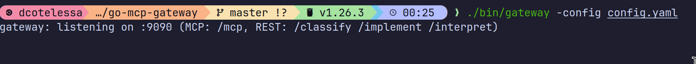
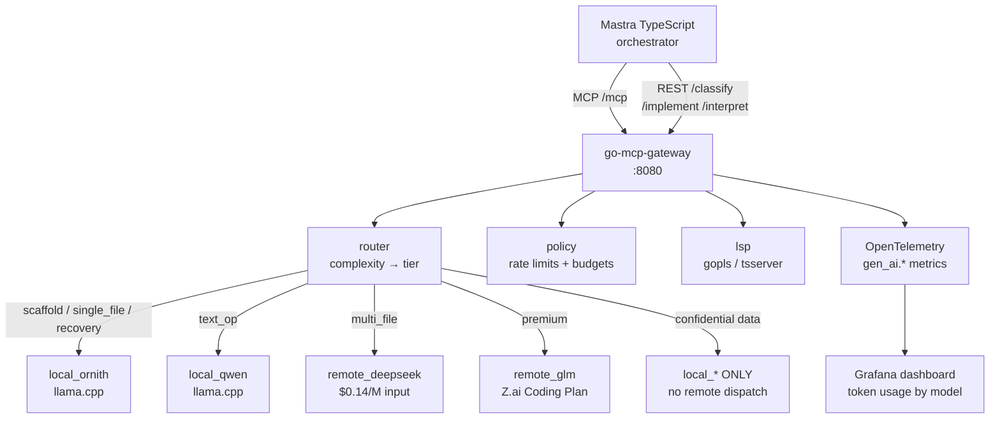
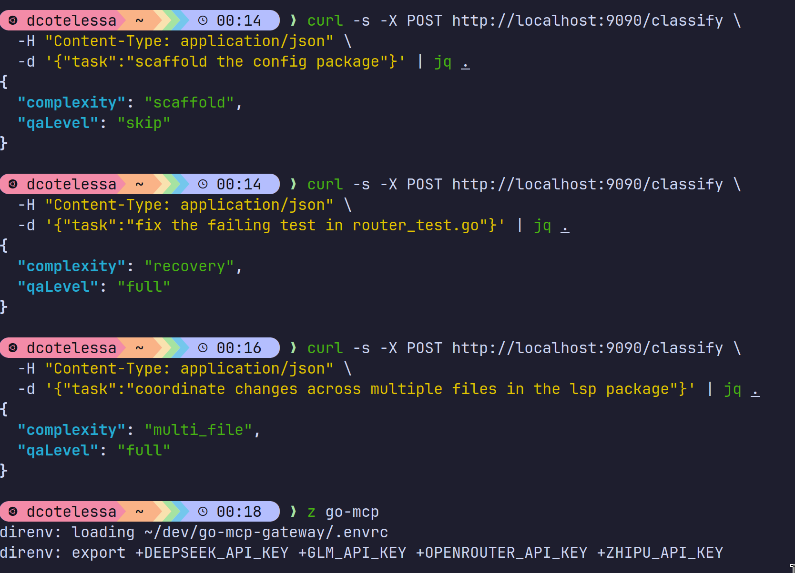
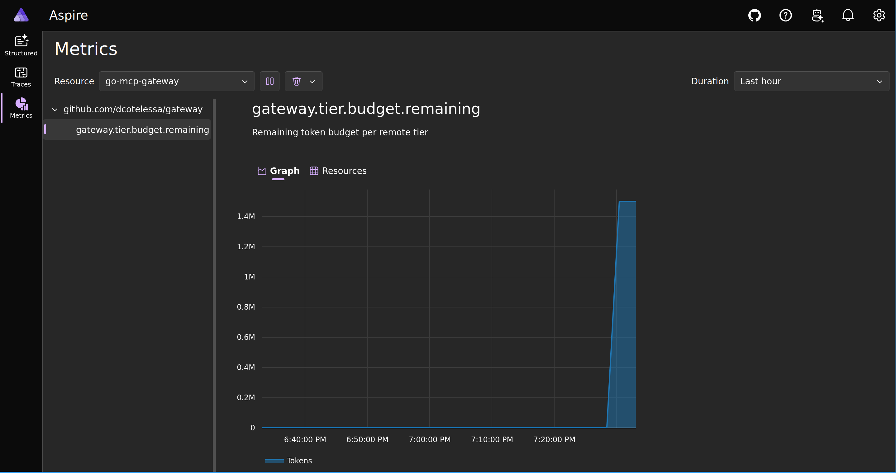

# go-mcp-gateway


A single Go binary that acts as both an **MCP tool server** and a **local model gateway** — routing LLM completion requests to local llama.cpp instances or remote APIs based on task complexity, with per-session rate limiting, token budget management, and LSP session bridging for code intelligence.

Built to solve a real problem: running a multi-agent AI development pipeline on a single GPU workstation where VRAM is the binding constraint and cost control across local and remote models matters.



---

## Why this exists

Most LLM gateway projects assume you either run everything locally or everything in the cloud. This gateway assumes neither. I built it for a specific architecture:

- A **Mastra TypeScript orchestrator** that needs to dispatch tasks to different model tiers based on complexity
- A **local GPU** (RTX 5060 Ti, 16GB VRAM) that can only hold one 35B model at a time
- **Remote API budgets** that need to be managed carefully across DeepSeek, GLM-5.2, and others
- **LSP sessions** (gopls, tsserver) that implementation agents need for compiler-grade feedback during TDD loops
- **Security-aware routing** that keeps confidential content on local models, never sending it to remote APIs

The result is a gateway that makes deliberate routing decisions: cheap local models for scaffolding and QA interpretation, capable remote models for multi-file implementation and test generation, automatic fallback cascades when budgets are exhausted, and hard local-only enforcement for sensitive workloads.

---

## Architecture



---

## Features

**MCP tool server** (primary interface)
- `route_complete` — routes a completion to the right model tier based on task complexity
- `budget_status` — queries token budgets per tier (local tiers use VRAM slot currency)
- `rate_status` — queries per-session rate limit status
- `lsp_open` / `lsp_diagnostics` / `lsp_hover` — code intelligence via gopls and tsserver

**REST facade** (backward-compatible secondary interface)
- `POST /classify` — maps task description to complexity + QA level
- `POST /implement` — routes a task to the appropriate model tier
- `POST /interpret` — maps vitest output to a structured QA verdict

**Local model management**
- Single-resident-model VRAM invariant — only one model loaded at a time
- Swap-on-demand queue with drain-then-kill protocol
- GPU/CPU layer split via `-sm layer` for models exceeding available VRAM (llama.cpp handles the rest via system RAM)
- Process lifecycle management via `os/exec`

**Token budget management**
- Three-tier cascade: Local → CheapAPI → Premium
- Per-session sliding window rate limiting (requests/minute)
- Per-session token budget (tokens/hour)
- Per-tier daily rolling window budgets
- Upstream 429 passthrough with automatic cascade and `reasoning_tags` compatible with Mastra workflow contract

**LSP session bridge**
- Workspace-keyed sessions decoupled from MCP session lifecycle
- JSON-RPC multiplexing over stdio (concurrent requests, single process per workspace)
- File sync via `textDocument/didOpen` / `textDocument/didChange`
- Idle eviction, crash recovery, graceful shutdown

**Security-aware routing** _(roadmap v0.6)_
- Data classification before dispatch: `public` → any tier, `confidential` → local only, `secret` → local only + no logging
- Pattern-based detection: file paths, env files, credential patterns, configured sensitive workspace roots
- Hard enforcement: remote APIs never called for confidential content regardless of complexity or budget
- Observable: `gateway.data.classification` attribute on every OTel span

---

## Model routing

The gateway uses task complexity — sourced from the Mastra workflow `complexity` enum — as the single source of truth for tier selection:

| Complexity | Default tier | Rationale |
|---|---|---|
| `scaffold` | local_ornith | Free, deterministic structure |
| `single_file` | local_ornith | Fast iteration, no cross-file reasoning |
| `recovery` | local_ornith | Tight loop, high frequency |
| `text_op` | local_qwen | Rename/reformat, minimal reasoning |
| `multi_file` | remote_deepseek | Cross-file contract awareness |

Fallback cascade on budget exhaustion: `remote_glm → remote_deepseek → local_ornith`

Security override (v0.6): `confidential` or `secret` classification bypasses all remote tiers regardless of complexity.

---

## Quick start

**Requirements**
- Go 1.26+
- [llama.cpp](https://github.com/ggerganov/llama.cpp) built with `llama-server`
- At least one GGUF model file
- Optional: `gopls` (`go install golang.org/x/tools/gopls@latest`) and/or `typescript-language-server` for LSP tools

```bash
# Clone and build
git clone https://github.com/dcotelessa/go-mcp-gateway
cd go-mcp-gateway
make build

# Configure
cp config.example.yaml config.yaml
# Edit config.yaml: set exec_path, model paths, and API keys

# Set API keys via environment (never put keys in config.yaml)
export DEEPSEEK_API_KEY=your-key
export GLM_API_KEY=your-key   # Z.ai Coding Plan key (ZHIPU_API_KEY)

# Run
./bin/gateway -config config.yaml
```

The gateway starts on `:8080` by default, serving MCP at `/mcp` and REST at `/classify`, `/implement`, `/interpret`.



**Connect from Mastra**

```typescript
// REST — works with existing Mastra workflows unchanged
const result = await fetch("http://localhost:9090/classify", {
  method: "POST",
  headers: { "Content-Type": "application/json" },
  body: JSON.stringify({ task: "scaffold the config package" }),
});
const { complexity, qaLevel } = await result.json();
// → { complexity: "scaffold", qaLevel: "skip" }
```

```typescript
// MCP — connect via @modelcontextprotocol/sdk
// (migration guide in docs/mcp-client.md)
```

---

## Configuration

See [`config.example.yaml`](./config.example.yaml) for the full schema. Key sections:

```yaml
llama_server:
  exec_path: /path/to/llama-server
  health_timeout_sec: 60

models:
  local_ornith:
    path: /path/to/ornith-1.0-35b-Q4_K_M.gguf
    vram_requirement_mib: 20000  # triggers -sm layer split automatically
    port: 8081

remote_apis:
  deepseek_base_url: https://api.deepseek.com/v1
  deepseek_api_key: ""  # set via DEEPSEEK_API_KEY env var

policy:
  session_rate_per_min: 20
  session_tokens_per_hour: 200000
  budget_deepseek_daily: 1000000
```

---

## OpenTelemetry observability

The gateway emits `gen_ai.*` semantic convention metrics for every completion routed through it — across both local and remote tiers. The goal is a feedback loop for comparing actual token efficiency, latency, and cost across models on real workloads, not synthetic benchmarks.

Planned metrics (following [OTel GenAI semantic conventions](https://opentelemetry.io/docs/specs/semconv/gen-ai/), currently experimental):

```
gen_ai.client.token.usage{
  gen_ai.system,           # "llama_cpp" | "deepseek" | "z_ai"
  gen_ai.request.model,    # "ornith-35b" | "deepseek-v4-flash" | "glm-5.2"
  gen_ai.token.type,       # "input" | "output"
  gateway.tier,            # "local_ornith" | "remote_deepseek" | ...
  gateway.complexity,      # "scaffold" | "single_file" | ...
  gateway.data_class,      # "public" | "internal" | "confidential"
}

gen_ai.client.operation.duration{gen_ai.request.model, gateway.tier, gateway.complexity}
gateway.tier.budget.remaining{gateway.tier, gateway.currency}
```

This data answers questions like:
- Which model tier produces the lowest tokens-per-task for scaffolding work?
- What is the actual cost difference between local and DeepSeek V4-Flash for single-file tasks?
- Where does the QA loop burn the most tokens across a feature build?

Export via OTLP to any compatible backend. I use Grafana + Prometheus locally. A small public dashboard showing aggregated (non-sensitive) routing statistics is planned for v0.5 — opt-in only, no prompt content ever exported.



---

## Project milestones

**v0.1 — Foundation** ✅ _(complete)_
- All seven packages implemented and tested
- 86 requirements across 5 spec files, 120+ tasks
- Race-detector clean across all packages
- MCP + REST dual surface, llama.cpp process management with VRAM-aware layer splitting

**v0.2 — OpenTelemetry** ✅ _(complete)_
- `gen_ai.client.token.usage` histogram per tier/model/complexity
- `gen_ai.client.operation.duration` histogram per tier/model/complexity
- `gateway.tier.budget.remaining` observable gauge for remote tiers
- OTLP HTTP exporter configurable via `config.yaml`
- Aspire Dashboard docker-compose for local development (`make dev-telemetry`)
- Traces on `/classify` and `/implement` handlers
- All metrics confirmed in Aspire Dashboard

**v0.3 — Remote API clients**
- Full DeepSeek V4-Flash client (streaming + non-streaming)
- GLM-5.2 client via Z.ai Coding Plan endpoint
- OpenRouter fallback client
- Upstream 429 Retry-After parsing per provider

**v0.4 — LSP diagnostics integration**
- `lsp_diagnostics` surfacing compiler errors to QA agents
- `lsp_definition` and `lsp_references` for implementation agents
- TypeScript and Go language server integration tests

**v0.5 — Public dashboard**
- Aggregated routing statistics (no prompt content, opt-in only)
- Model comparison: tokens per task by complexity tier
- Cost efficiency charts across local vs remote tiers
- Open data export (CSV) for community analysis

**v0.6 — Security-aware routing**
- Data classification engine before every dispatch
- Pattern-based detection (file paths, env files, credential patterns)
- Hard local-only enforcement for confidential and secret classifications
- Observable via `gateway.data.classification` OTel span attribute
- Configurable sensitive workspace root list

**v1.0 — Stable**
- Semver stability commitment
- Multi-GPU support (multiple resident models)
- OTel GenAI semantic conventions v1.0 (post-experimental)

---

## Contributing

This project uses spec-driven development via [OpenSpec](https://github.com/fission-ai/openspec). Feature proposals follow the `propose → implement → archive` lifecycle in `openspec/changes/`.

**Issues**
- Bug reports and feature requests welcome via [GitHub Issues](../../issues)
- Issues are triaged as time allows — I'm a solo maintainer with client commitments
- Security issues: please use GitHub's [private vulnerability reporting](../../security/advisories/new), not public issues

**Pull requests**
- All PRs require a passing test suite with `-race` flag (`make test`)
- New behavior requires a corresponding spec scenario in `openspec/changes/`
- The `reasoning_tags` contract with Mastra must not break without a migration path
- PRs without a linked issue may not be reviewed promptly

**Discussion**
[GitHub Discussions](../../discussions) is enabled for questions, ideas, and sharing how you've adapted the gateway for your own model mix. I'm particularly interested in hearing about different VRAM/model configurations and routing strategies.

---

## License

MIT License — see [LICENSE](./LICENSE).

Designed to be embedded in private pipelines without attribution requirements. If you build something interesting on top of it, I'd love to hear about it in Discussions.

---

## Acknowledgements

Built with:
- [mcp-go](https://github.com/mark3labs/mcp-go) — MCP server implementation for Go
- [llama.cpp](https://github.com/ggerganov/llama.cpp) — local LLM inference
- [OpenTelemetry Go SDK](https://github.com/open-telemetry/opentelemetry-go) — observability
- [OpenSpec](https://github.com/fission-ai/openspec) — spec-driven development

Routing decisions informed by real workload data from a multi-agent TypeScript pipeline using [Mastra](https://mastra.ai).
